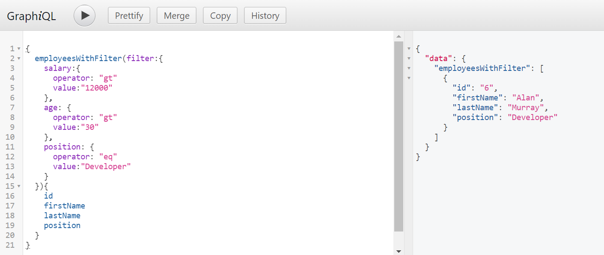
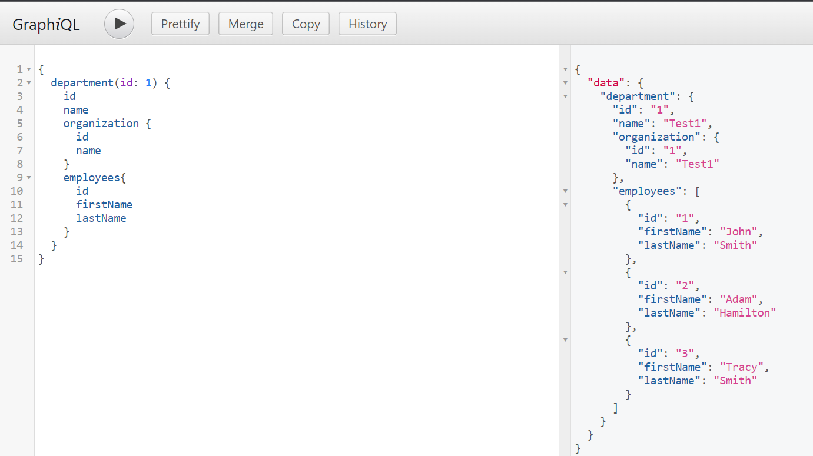

# spring-boot-graphql-h2db
Motive behind the project is to understand Hibernate N+1 problem and how to resolve that.

# Getting Started
I have implemented three entities Employee, Department and Organization – each of them stored in the separated table. A relationship model between them has been visualized in the picture below.

#### 1. Dependencies
```xml
<dependencies>
    <dependency>
      <groupId>org.springframework.boot</groupId>
      <artifactId>spring-boot-starter-data-jpa</artifactId>
    </dependency>
    <dependency>
      <groupId>com.graphql-java-kickstart</groupId>
      <artifactId>graphql-spring-boot-starter</artifactId>
      <version>12.0.0</version>
      <exclusions>
        <exclusion>
          <artifactId>reflections</artifactId>
          <groupId>org.reflections</groupId>
        </exclusion>
      </exclusions>
    </dependency>
    <dependency>
      <groupId>org.projectlombok</groupId>
      <artifactId>lombok</artifactId>
      <scope>provided</scope>
    </dependency>
    <dependency>
      <groupId>com.graphql-java</groupId>
      <artifactId>graphql-spring-boot-starter</artifactId>
      <version>5.0.2</version>
      <exclusions>
        <exclusion>
          <artifactId>guava</artifactId>
          <groupId>com.google.guava</groupId>
        </exclusion>
      </exclusions>
    </dependency>
    <dependency>
      <groupId>com.graphql-java</groupId>
      <artifactId>graphiql-spring-boot-starter</artifactId>
      <version>5.0.2</version>
      <exclusions>
        <exclusion>
          <artifactId>graphiql-spring-boot-autoconfigure</artifactId>
          <groupId>com.graphql-java</groupId>
        </exclusion>
      </exclusions>
    </dependency>
    <dependency>
      <groupId>com.h2database</groupId>
      <artifactId>h2</artifactId>
      <scope>runtime</scope>
    </dependency>
    <dependency>
      <groupId>com.graphql-java</groupId>
      <artifactId>graphql-java</artifactId>
      <version>18.1</version>
    </dependency>
    <dependency>
      <groupId>org.springframework.boot</groupId>
      <artifactId>spring-boot-starter-test</artifactId>
      <scope>test</scope>
    </dependency>
  </dependencies>
 ```
#### 2. Schemas
We are starting implementation from defining GraphQL schemas with objects, queries and mutations definitions. The files are located inside /src/main/resources/graphql directory and after adding graphql-spring-boot-starter they are automatically detected by the application basing on their suffix *.graphqls.
GraphQL schema for each entity is located in the separated file.
- ##### department.graphqls
    ```text
    type QueryResolver {
        departments: [Department]
        department(id: ID!): Department!
    }
    
    type MutationResolver {
        newDepartment(department: DepartmentInput!): Department
    }
    
    input DepartmentInput {
        name: String!
        organizationId: Int
    }
    
    type Department {
        id: ID!
        name: String!
        organization: Organization
        employees: [Employee]
    }
    ```
- ##### organization.graphqls
    ```text
      extend type QueryResolver {
        organizations: [Organization]
        organization(id: ID!): Organization!
    }
    
    extend type MutationResolver {
    newOrganization(organization: OrganizationInput!): Organization
    }
    
    input OrganizationInput {
    name: String!
    }
    
    type Organization {
    id: ID!
    name: String!
    employees: [Employee]
    departments: [Department]
    }
    ```
  - ##### employee.graphqls
      ```text
      extend type QueryResolver {
        employees: [Employee]
        employeesWithFilter(filter: EmployeeFilter): [Employee]
        employee(id: ID!): Employee!
      }
    
      extend type MutationResolver {
        newEmployee(employee: EmployeeInput!): Employee
      }
    
      input EmployeeInput {
        firstName: String!
        lastName: String!
        position: String!
        salary: Int
        age: Int
        organizationId: Int!
        departmentId: Int!
      }
    
      type Employee {
        id: ID!
        firstName: String!
        lastName: String!
        position: String!
        salary: Int
        age: Int
        department: Department
        organization: Organization
      }
    
      input EmployeeFilter {
        salary: FilterField
        age: FilterField
        position: FilterField
      }
    
      input FilterField {
        operator: String!
        value: String!
      }
    
      schema {
        query: QueryResolver
        mutation: MutationResolver
      }
      ```
#### 3. Domain model
- Department entity
    ```java
    @Entity
    @Data
    @AllArgsConstructor
    @NoArgsConstructor
    @EqualsAndHashCode(onlyExplicitlyIncluded = true)
    public class Department {
      @Id
      @GeneratedValue
      @EqualsAndHashCode.Include
      private Integer id;
      private String name;
      @OneToMany(mappedBy = "department")
      private Set<Employee> employees;
      @ManyToOne(fetch = FetchType.LAZY)
      private Organization organization;
  }
  ```
- Employee entity
  ```java
  @Entity
  @Data
  @NoArgsConstructor
  @AllArgsConstructor
  @EqualsAndHashCode(onlyExplicitlyIncluded = true)
  public class Employee {
    @Id
    @GeneratedValue
    @EqualsAndHashCode.Include
    private Integer id;
    private String firstName;
    private String lastName;
    private String position;
    private int salary;
    private int age;
    @ManyToOne(fetch = FetchType.LAZY)
    private Department department;
    @ManyToOne(fetch = FetchType.LAZY)
    private Organization organization;
  }
  ```
- Organization entity
  ```java
  @Entity
  @Data
  @AllArgsConstructor
  @NoArgsConstructor
  @EqualsAndHashCode(onlyExplicitlyIncluded = true)
  public class Organization {
    @Id
    @GeneratedValue
    @EqualsAndHashCode.Include
    private Integer id;
    private String name;
    @OneToMany(mappedBy = "organization")
    private Set<Department> departments;
    @OneToMany(mappedBy = "organization")
    private Set<Employee> employees;
  }
    ```
  Entity classes are returned as a result by queries. In mutations we are using input objects that have slightly different implementation. They do not contain reference to a relationship, but only an id of related objects.
    ```java
    @Data
    @AllArgsConstructor
    @NoArgsConstructor
    public class DepartmentInput {
    private String name;
    private Integer organizationId;
    }
    ```

#### 4. Fetch relations
```json lines
departments {
    id
    name
    organization {
      id
      name
    }
  }
}
```
Now, the question is how to handle it on the server side. The first thing we need to do is to detect the existence of such a relationship field in our GraphQL query. Why? Because we need to avoid possible N+1 problem, which happens when the data access framework executes N additional SQL statements to fetch the same data that could have been retrieved when executing the primary SQL query. So, we need to prepare different JPA queries depending on the parameters set in the GraphQL query. We may do it in several ways, but the most convenient way is by using DataFetchingEnvironment parameter inside QueryResolver implementation.
Let’s take a look on the implementation of QueryResolver for Department. If we annotate class that implements GraphQLQueryResolver with @Component it is automatically detected by Spring Boot (thanks to graphql-spring-boot-starter). Then we are adding DataFetchingEnvironment as a parameter to each query. After that we should invoke method getSelectionSet() on DataFetchingEnvironment object and check if it contains word organization (for fetching Organization) or employees (for fetching list of employees). Depending on requested relations we build different queries. In the following fragment of code we have two methods implemented for DepartmentQueryResolver: findAll and findById.

```java
@Component
public class DepartmentMutableResolver implements GraphQLMutationResolver {

  DepartmentRepository departmentRepository;
  OrganizationRepository organizationRepository;

  DepartmentMutableResolver(DepartmentRepository departmentRepository, OrganizationRepository organizationRepository) {
    this.departmentRepository = departmentRepository;
    this.organizationRepository = organizationRepository;
  }

  public Department newDepartment(DepartmentInput departmentInput) {
    Organization organization = organizationRepository.findById(departmentInput.getOrganizationId()).get();
    return departmentRepository.save(new Department(null, departmentInput.getName(), null, organization));
  }

}
```
The most convenient way to build dynamic queries is by using JPA Criteria API. To be able to use it with Spring Data JPA we first need to extend our repository interface with JpaSpecificationExecutor interface. After that you may use the additional interface methods that let you execute specifications in a variety of ways. You may choose between findAll and findOne methods.

```java

public interface DepartmentRepository extends CrudRepository<Department, Integer>,
    JpaSpecificationExecutor<Department>{

}
```
Finally, we may just prepare methods that build Specification the object. This object contains a predicate. In that case we are using three predicates for fetching organization, employees and filtering by id.
```java
private Specification<Department> fetchOrganization() {
  return (Specification<Department>) (root, query, builder) -> {
    Fetch<Department, Organization> f = root.fetch("organization", JoinType.LEFT);
    Join<Department, Organization> join = (Join<Department, Organization>) f;
    return join.getOn();
  };
}

private Specification<Department> fetchEmployees() {
  return (Specification<Department>) (root, query, builder) -> {
    Fetch<Department, Employee> f = root.fetch("employees", JoinType.LEFT);
    Join<Department, Employee> join = (Join<Department, Employee>) f;
    return join.getOn();
  };
}

private Specification<Department> byId(Integer id) {
  return (Specification<Department>) (root, query, builder) -> builder.equal(root.get("id"), id);
}
```
#### 5. Filtering
For a start, let’s refer to the section 2 – Schemas. Inside employee.graphqls I defined two additional inputs FilterField and EmployeeFilter, and also a single method employeesWithFilter that takes EmployeeFilter as an argument. The FieldFilter class is my custom implementation of a filter for GraphQL queries. It is very trivial. It provides an implementation of two filter types: for number or for string. It generates JPA Criteria Predicate. Of course, instead creating such filter implementation by yourself (like me), you may leverage some existing libraries for that. However, it does not require much time to do it by yourself as you see in the following code. Our custom filter implementation has two parameters: operator and value.
```java
@Data
public class FilterField {
  private String operator;
  private String value;

  public Predicate generateCriteria(CriteriaBuilder builder, Path field) {
    try {
      int v = Integer.parseInt(value);
      switch (operator) {
      case "lt": return builder.lt(field, v);
      case "le": return builder.le(field, v);
      case "gt": return builder.gt(field, v);
      case "ge": return builder.ge(field, v);
      case "eq": return builder.equal(field, v);
      }
    } catch (NumberFormatException e) {
      switch (operator) {
      case "endsWith": return builder.like(field, "%" + value);
      case "startsWith": return builder.like(field, value + "%");
      case "contains": return builder.like(field, "%" + value + "%");
      case "eq": return builder.equal(field, value);
      }
    }

    return null;
  }
}
```
Now, with FilterField we may create a concrete implementation of filters consisting of several simple FilterField. The example of such implementation is EmployeeFilter class that has three possible criterias of filtering by salary, age and position.
```java
@Data
public class EmployeeFilter {
  private FilterField salary;
  private FilterField age;
  private FilterField position;
}
```
Now if you would like to use that filter in your GraphQL query you should create something like that. In that query we are searching for all developers that has a salary greater than 12000 and age greater than 30 years.
```json5
{
  employeesWithFilter(filter: {
    salary: {
      operator: "gt"
      value: "12000"
    },
    age: {
      operator: "gt"
      value: "30"
    },
    position: {
      operator: "eq",
      value: "Developer"
    }
  }) {
    id
    firstName
    lastName
    position
  }
}
```

Let’s take a look at the implementation of query resolver. The same as for fetching relations we are using JPA Criteria API and Specification class. I have three methods that creates Specification for each of possible filter fields. Then I’m building dynamically filtering criterias based on the content of EmployeeFilter.
```java
@Component
public class EmployeeQueryResolver implements GraphQLQueryResolver {

  private EmployeeRepository repository;

  EmployeeQueryResolver(EmployeeRepository repository) {
    this.repository = repository;
  }

  public Iterable<Employee> employees() {
    return repository.findAll();
  }

  public Employee employee(Integer id) {
    return repository.findById(id).get();
  }

  public Iterable<Employee> employeesWithFilter(EmployeeFilter filter) {
    Specification<Employee> spec = null;
    if (filter.getSalary() != null)
      spec = bySalary(filter.getSalary());
    if (filter.getAge() != null)
      spec = (spec == null ? byAge(filter.getAge()) : spec.and(byAge(filter.getAge())));
    if (filter.getPosition() != null)
      spec = (spec == null ? byPosition(filter.getPosition()) :
          spec.and(byPosition(filter.getPosition())));
    if (spec != null)
      return repository.findAll(spec);
    else
      return repository.findAll();
  }

  private Specification<Employee> bySalary(FilterField filterField) {
    return (Specification<Employee>) (root, query, builder) -> filterField.generateCriteria(builder, root.get("salary"));
  }

  private Specification<Employee> byAge(FilterField filterField) {
    return (Specification<Employee>) (root, query, builder) -> filterField.generateCriteria(builder, root.get("age"));
  }

  private Specification<Employee> byPosition(FilterField filterField) {
    return (Specification<Employee>) (root, query, builder) -> filterField.generateCriteria(builder, root.get("position"));
  }
}
```
#### 6. Testing Spring Boot GraphQL JPA support
We will insert some test data into the H2 database by defining data.sql inside src/main/resources directory.

```roomsql
insert into organization (id, name) values (1, 'Test1');
insert into organization (id, name) values (2, 'Test2');
insert into organization (id, name) values (3, 'Test3');
insert into organization (id, name) values (4, 'Test4');
insert into organization (id, name) values (5, 'Test5');
insert into department (id, name, organization_id) values (1, 'Test1', 1);
insert into department (id, name, organization_id) values (2, 'Test2', 1);
insert into department (id, name, organization_id) values (3, 'Test3', 1);
insert into department (id, name, organization_id) values (4, 'Test4', 2);
insert into department (id, name, organization_id) values (5, 'Test5', 2);
insert into department (id, name, organization_id) values (6, 'Test6', 3);
insert into department (id, name, organization_id) values (7, 'Test7', 4);
insert into department (id, name, organization_id) values (8, 'Test8', 5);
insert into department (id, name, organization_id) values (9, 'Test9', 5);
insert into employee (id, first_name, last_name, position, salary, age, department_id, organization_id) values (1, 'John', 'Smith', 'Developer', 10000, 30, 1, 1);
insert into employee (id, first_name, last_name, position, salary, age, department_id, organization_id) values (2, 'Adam', 'Hamilton', 'Developer', 12000, 35, 1, 1);
insert into employee (id, first_name, last_name, position, salary, age, department_id, organization_id) values (3, 'Tracy', 'Smith', 'Architect', 15000, 40, 1, 1);
insert into employee (id, first_name, last_name, position, salary, age, department_id, organization_id) values (4, 'Lucy', 'Kim', 'Developer', 13000, 25, 2, 1);
insert into employee (id, first_name, last_name, position, salary, age, department_id, organization_id) values (5, 'Peter', 'Wright', 'Director', 50000, 50, 4, 2);
insert into employee (id, first_name, last_name, position, salary, age, department_id, organization_id) values (6, 'Alan', 'Murray', 'Developer', 20000, 37, 4, 2);
insert into employee (id, first_name, last_name, position, salary, age, department_id, organization_id) values (7, 'Pamela', 'Anderson', 'Analyst', 7000, 27, 4, 2);
```
Now, we can easily perform some test queries by using GraphiQL that is embedded into our application and available under address http://localhost:8080/graphiql after startup. First, let’s verify the filtering query.

Now, we may test fetching by searching Department by id and fetching a list of employees and organization.



### Reference Documentation
For further reference, please consider the following sections:

* [Official Apache Maven documentation](https://maven.apache.org/guides/index.html)
* [Spring Boot Maven Plugin Reference Guide](https://docs.spring.io/spring-boot/docs/2.7.1/maven-plugin/reference/html/)
* [Create an OCI image](https://docs.spring.io/spring-boot/docs/2.7.1/maven-plugin/reference/html/#build-image)
* [GraphQL | A query language for your API](https://graphql.org/)
* [Spring Web](https://docs.spring.io/spring-boot/docs/2.7.1/reference/htmlsingle/#web)
* [Spring for GraphQL Documentation](https://docs.spring.io/spring-graphql/docs/current-SNAPSHOT/reference/html/)
* [Spring for GraphQL](https://spring.io/projects/spring-graphql)

### Guides
The following guides illustrate how to use some features concretely:

* [Building a RESTful Web Service](https://spring.io/guides/gs/rest-service/)
* [Serving Web Content with Spring MVC](https://spring.io/guides/gs/serving-web-content/)
* [Building REST services with Spring](https://spring.io/guides/tutorials/rest/)


